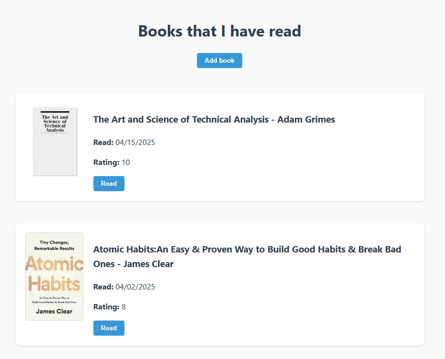
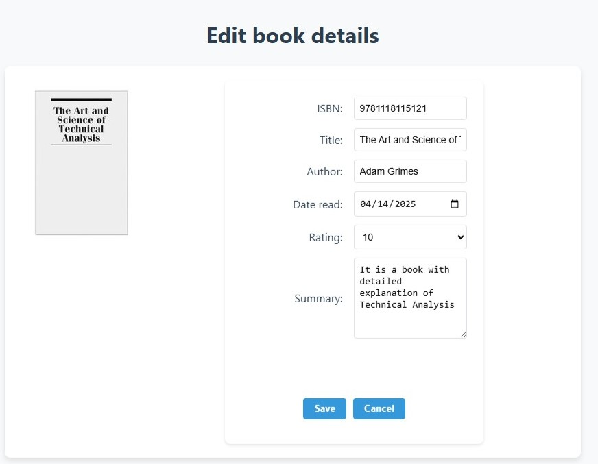

# Book notes app

This book notes app involves ejs and PostgreSQL.
</br>


</br>
</br>


### Copy the code to local directory
Run the following command in your local folder after logging in with your Github account:
```
git clone https://github.com/ma-edw/book_notes/
```

### Install required packages with npm
```
npm install
```

### Create a .env file
Include your PostgreSQL database password and the name of the database to store the books in the file. 

For example,
```
DATABASE = "Database_name"
DATABASE_PW = "Database_password"
```

### Run the code
```
npm start
```
The app will be available in http://localhost:3000/
